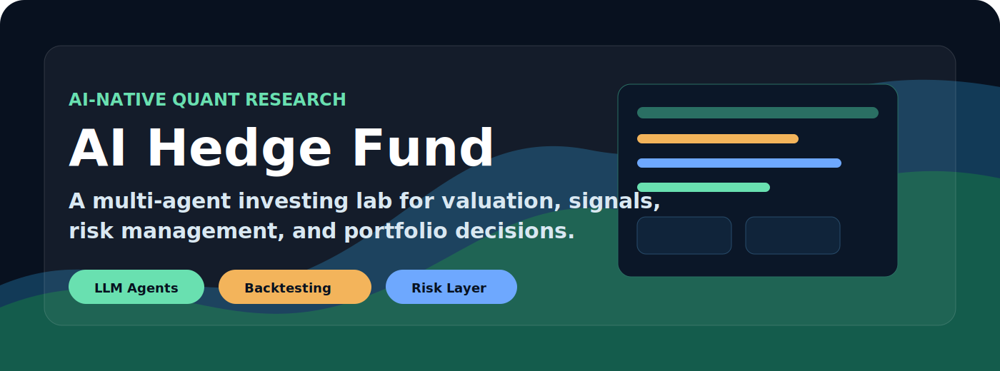
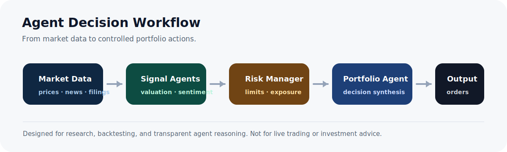
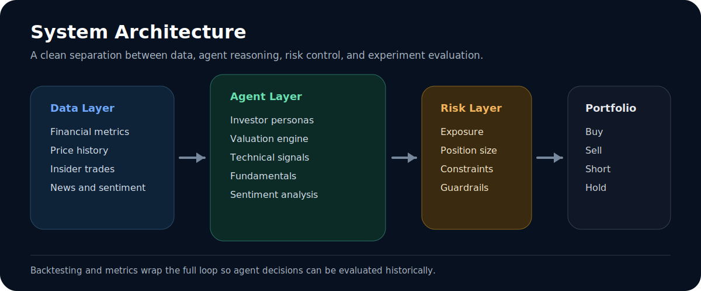

<p align="center">
  
</p>

<h1 align="center">AI Hedge Fund</h1>

<p align="center">
  <strong>A multi-agent quant research lab for market analysis, valuation, risk control, and portfolio decisions.</strong>
  <br />
  <strong>一个面向量化研究、市场分析、估值判断、风险控制与组合决策的多智能体 AI 投研实验室。</strong>
</p>

<p align="center">
  <a href="https://github.com/jsdnaasd/ai-hedge-fund/stargazers"></a>
  <a href="https://github.com/jsdnaasd/ai-hedge-fund/network/members"></a>
  <a href="LICENSE"></a>
  
</p>

<p align="center">
  <a href="#why-this-project">Why</a> ·
  <a href="#中文介绍">中文介绍</a> ·
  <a href="#agent-team">Agent Team</a> ·
  <a href="#architecture">Architecture</a> ·
  <a href="#quick-start">Quick Start</a> ·
  <a href="#disclaimer">Disclaimer</a>
</p>

---

## Why This Project

AI Hedge Fund turns the idea of an investment committee into a programmable agent system. Instead of asking one model for a trade, it coordinates specialized agents that analyze fundamentals, valuation, sentiment, technicals, macro-style risk, and portfolio constraints before producing a final decision.

This repository is designed for builders who want to study:

- how LLM agents can be organized into a financial research workflow;
- how valuation, risk, sentiment, and technical signals can be combined;
- how a backtesting layer can turn model outputs into measurable experiments;
- how an AI-native investing interface can be structured without putting an LLM directly on the live order path.

> This is a research and education project, not financial advice and not a live trading system.

## 中文介绍

AI Hedge Fund 是一个把「投资委员会」抽象成多智能体系统的量化投研项目。它不是简单地让一个大模型直接给出买卖建议，而是让多个专业 Agent 分别从基本面、估值、情绪、技术指标、风险暴露和组合约束等角度进行分析，最后由风险管理与组合管理模块综合生成决策。

这个项目适合关注 AI + Quant + Web3/金融自动化方向的开发者研究：

- 如何把 LLM Agent 组织成可扩展的金融研究流程；
- 如何把估值、基本面、市场情绪、技术指标等信号合并为结构化观点；
- 如何通过回测层把 Agent 输出转化为可评估的实验结果；
- 如何设计一个 AI-native 的投研系统，同时避免让大模型直接进入真实下单路径。

> 本项目仅用于技术研究、教育学习和系统设计参考，不构成任何投资建议，也不是实盘交易系统。

## Featured Workflow

<p align="center">
  
</p>

## Agent Team

The system includes a full research desk of specialized agents:

系统内置了一组类似「AI 投研团队」的专业智能体：

| Layer | Agents | Role |
| --- | --- | --- |
| Legendary investors | Warren Buffett, Charlie Munger, Ben Graham, Peter Lynch, Michael Burry, Mohnish Pabrai, Bill Ackman, Cathie Wood, Stanley Druckenmiller, Phil Fisher, Rakesh Jhunjhunwala, Aswath Damodaran, Nassim Taleb | Different investment philosophies, valuation styles, and risk lenses |
| Signal engines | Valuation, Fundamentals, Sentiment, News Sentiment, Technicals, Growth | Generate interpretable market signals |
| Control layer | Risk Manager, Portfolio Manager | Position sizing, exposure limits, and final decision synthesis |
| Experiment layer | Backtester, Metrics, Benchmarks | Evaluate decisions over historical data |

中文理解：

- **投资大师 Agent**：模拟不同投资流派的分析框架，例如价值投资、成长投资、逆向投资、宏观风险和安全边际。
- **信号 Agent**：负责估值、基本面、新闻情绪、技术指标和成长性分析。
- **控制层 Agent**：负责风险预算、仓位限制、敞口控制和最终组合决策。
- **实验层**：通过回测、指标和基准对策略行为进行验证。

## Architecture

<p align="center">
  
</p>

The project is structured around a clean research loop:

1. **Data ingestion** loads prices, financial metrics, insider trades, and news.
2. **Agent analysis** converts raw data into structured opinions and signals.
3. **Risk management** constrains exposure before any portfolio action is proposed.
4. **Portfolio synthesis** combines signals into buy, sell, short, cover, or hold decisions.
5. **Backtesting** measures behavior with reproducible historical experiments.

中文流程：

1. **数据层**：加载价格、财务指标、内部交易、新闻与市场数据。
2. **Agent 分析层**：把原始数据转化为结构化观点、评分和交易信号。
3. **风险管理层**：在组合动作发生前约束仓位、敞口和风险边界。
4. **组合决策层**：综合多方观点生成 buy、sell、short、cover 或 hold。
5. **回测评估层**：用历史数据检验 Agent 决策是否具有可解释性和可复现性。

## What Makes It Interesting

- **Multi-agent by design**: different agents represent different investment frameworks instead of one generic chatbot.
- **Risk-aware workflow**: risk and portfolio management are explicit layers.
- **Backtestable outputs**: decisions can be evaluated instead of admired in isolation.
- **Local model support**: optional Ollama flow for running local LLMs.
- **Extensible agent surface**: new investment styles, indicators, and data sources can be added as separate agents.

中文亮点：

- **多智能体架构**：不是一个泛泛的聊天机器人，而是多个角色化 Agent 协同分析。
- **风险控制明确**：风险管理和组合管理是独立层，不把决策黑箱化。
- **可回测**：Agent 输出可以进入历史实验，而不是停留在文本结论。
- **支持本地模型**：可通过 Ollama 使用本地 LLM，适合低成本实验。
- **易扩展**：可以继续加入新的投资风格、链上数据、技术指标或策略模块。

## Quick Start

### 1. Clone

```bash
git clone https://github.com/jsdnaasd/ai-hedge-fund.git
cd ai-hedge-fund
```

### 2. Configure API Keys

```bash
cp .env.example .env
```

Add at least one LLM provider key:

```bash
OPENAI_API_KEY=your-openai-api-key
FINANCIAL_DATASETS_API_KEY=your-financial-datasets-api-key
```

You can also use other supported providers such as Anthropic, Groq, DeepSeek, or local Ollama models depending on your setup.

### 3. Install

```bash
curl -sSL https://install.python-poetry.org | python3 -
poetry install
```

### 4. Run the Agent Team

```bash
poetry run python src/main.py --ticker AAPL,MSFT,NVDA
```

Run with local LLMs:

```bash
poetry run python src/main.py --ticker AAPL,MSFT,NVDA --ollama
```

Run over a specific period:

```bash
poetry run python src/main.py --ticker AAPL,MSFT,NVDA --start-date 2024-01-01 --end-date 2024-03-01
```

### 5. Backtest

```bash
poetry run python src/backtester.py --ticker AAPL,MSFT,NVDA
```

## Web Application

The repository also includes a web application interface for users who prefer a visual workflow over the CLI. See the application guide in [`app/`](app/) if present in your checkout.

仓库也包含 Web 应用界面，适合更偏可视化操作的用户。相比 CLI，Web 界面更适合展示 Agent 分析流程和投研结果。

## Roadmap Ideas

- Crypto-native market data adapters
- On-chain wallet and protocol intelligence agents
- Agent memory for recurring market theses
- Strategy leaderboard with reproducible backtests
- Risk dashboards for position-level attribution
- Paper-trading mode with strict human approval

## 中文路线图

- 接入 crypto-native 市场数据与链上数据源
- 增加钱包行为、协议事件、资金流向等链上智能分析 Agent
- 为 Agent 增加长期记忆，用于追踪持续市场假设
- 建立可复现回测排行榜，比较不同 Agent 组合表现
- 增加风险归因仪表盘，展示仓位、行业、因子和信号贡献
- 加入严格人工确认的 paper trading 模式

## Disclaimer

This project is for **educational and research purposes only**.

- It is not investment advice.
- It is not intended for live trading.
- It does not guarantee returns.
- Past performance does not imply future results.
- You are responsible for your own research, risk controls, and financial decisions.

中文免责声明：

- 本项目仅用于教育、研究和工程学习。
- 不构成投资建议。
- 不应用于真实交易或自动下单。
- 不承诺任何收益。
- 历史表现不代表未来结果。
- 使用者需要自行承担研究、风险控制和金融决策责任。

## Attribution

This repository is a fork and presentation-enhanced edition of [`virattt/ai-hedge-fund`](https://github.com/virattt/ai-hedge-fund), originally released under the MIT License. The original copyright and license are preserved in this repository.

中文说明：本仓库是基于 [`virattt/ai-hedge-fund`](https://github.com/virattt/ai-hedge-fund) 的 fork 与展示增强版本，原项目基于 MIT License 发布。本仓库保留原始版权与许可证说明。

## License

MIT License. See [`LICENSE`](LICENSE) for details.
